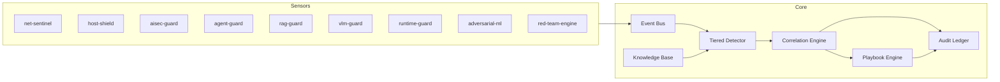

# Aegis Sentinel — Architecture

## Purpose

Aegis Sentinel is a unified security operations platform that ingests telemetry from network sensors, endpoints, and AI/LLM workloads, normalizes it into a single event schema, runs tiered detection, correlates alerts into incidents, and optionally executes SOAR playbooks with tamper-evident audit logging.

## Design Principles

| Principle | Implementation |
|-----------|----------------|
| Normalize early | All modules emit `NormalizedEvent` |
| Defense in depth | Tier 0–3 detection pipeline |
| Fail safe | Auto-response disabled by default; simulation mode for firewall actions |
| Auditability | SHA-256 hash-chained audit ledger |
| Pluggable modules | `SecurityModule` interface per cyber project |
| Offline ML | Train once, infer at runtime (Isolation Forest) |

## High-Level Data Flow

## Component Reference

### `aegis/platform.py` — Orchestrator

- Registers all nine security modules
- Runs `TieredDetector.analyze()` on every ingest
- Invokes module-specific `detect()` logic
- Applies alert deduplication (30s window, keyed by module + entity + MITRE + kb_refs + description hash)
- Triggers SOAR when `auto_respond=true` or `AUTO_RESPONSE_ENABLED=true`
- Imports red-team ATLAS mappings on startup

### `aegis/core/schema.py` — Canonical Types

- `NormalizedEvent` — unit of telemetry
- `Alert` — detection output with recommended playbooks
- `Incident` — correlated group of alerts
- `RemediationResult` — SOAR execution outcome

### `aegis/engine/detectors/tiered.py` — Detection Pipeline

| Tier | Function | Latency |
|------|----------|---------|
| 0 | Event dedup (60s TTL) | <1 ms |
| 1 | IOC match (IP, domain, hash) | <5 ms |
| 2 | Signature/heuristic rules | <10 ms |
| 3 | Isolation Forest anomaly score | <20 ms |

### `aegis/core/correlation.py` — Incident Linking

Alerts merge into the same incident when:

1. Same entity within the correlation window (default 300s), **and**
2. MITRE ID overlap, kb_ref overlap, or adjacent kill-chain stages

Unrelated alerts from the same module (e.g., port scan vs DNS tunnel) remain separate.

### `aegis/engine/soar/playbook.py` — Response Automation

YAML playbooks in `knowledge-base/playbooks/`:

- `block_ip`, `rate_limit_scanner`, `isolate_host`, `kill_process`
- `block_llm_request`, `alert_soc_llm`, `alert_soc_generic`

Each playbook supports verify and rollback steps. Tier-3 playbooks require `force=True` unless `AUTO_RESPONSE_ENABLED=true`.

### `aegis/core/audit.py` — Tamper-Evident Ledger

Every alert creation and remediation appends a hash-chained record. `verify_chain()` validates integrity for compliance audits.

## Security Modules (Projects 04–10)

| Module | Project | Input | Primary Threats |
|--------|---------|-------|-----------------|
| `aisec-guard` | 04 | LLM prompts | Jailbreak, prompt injection, crescendo |
| `agent-guard` | 05 | Agent tool output | Tool poisoning, indirect injection |
| `rag-guard` | 06 | RAG chunks | Corpus poisoning, context injection |
| `vlm-guard` | 07 | Image metadata/path | Adversarial images, steganography hints |
| `runtime-guard` | 08 | Falco/runtime alerts | Container escape, docker socket access |
| `adversarial-ml` | 09 | Feature vectors | Evasion, model abuse |
| `red-team-engine` | 10 | Red team findings | ATLAS technique import |
| `net-sentinel` | — | Flows, DNS | Port scan, C2, lateral movement |
| `host-shield` | — | Log lines, hashes | Brute force, malware, credential theft |

## Deployment Profiles

| Profile | Event Bus | Resources | Use Case |
|---------|-----------|-----------|----------|
| `personal` | In-memory | 512 MB RAM | Home lab, single host |
| `smb` | In-memory or Redis | 1–2 GB | Small business |
| `enterprise` | Redis | 4+ GB, HA | SOC integration, multi-site |

## Extension Points

1. **New sensor** — implement `SecurityModule`, register in `AegisPlatform.modules`
2. **New playbook** — add YAML under `knowledge-base/playbooks/`
3. **New IOCs** — POST via knowledge API or edit `seed_iocs.json`
4. **SIEM export** — subscribe to event bus or poll `/alerts`
5. **Firewall** — configure `aegis/integrations/firewall.py` (iptables; simulation by default)

## Threat Model Assumptions

- API key is the primary authentication boundary
- SQLite WAL handles concurrent writes for audit and correlation
- SOAR actions default to simulation until explicitly configured
- Rate limiting protects ingest endpoints (120 req/min per IP)
