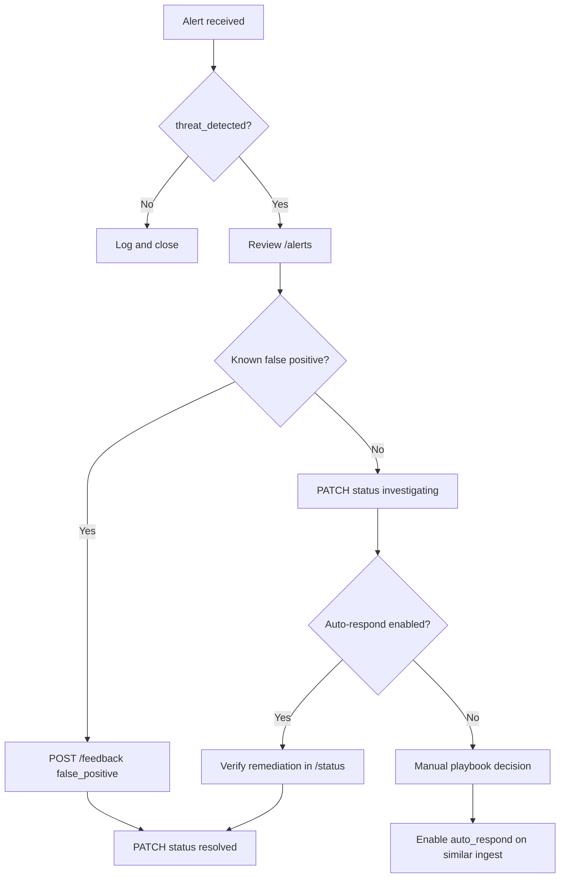

# Operator Runbook — Incident Response

## Severity Handling

| Severity | SLA (acknowledge) | Default Playbook |
|----------|-------------------|------------------|
| CRITICAL | 15 min | `isolate_host`, `kill_process` |
| HIGH | 1 hour | `block_ip`, `block_llm_request` |
| MEDIUM | 4 hours | `rate_limit_scanner`, `alert_soc_generic` |
| LOW | Next business day | `alert_soc_generic` |

## Triage Workflow



## Common Scenarios

### LLM Jailbreak Attempt

1. Check alert: `source_module=aisec-guard`, tags include `jailbreak`
2. Review prompt in incident (truncated in API; full in audit ledger)
3. Action: confirm `block_llm_request` playbook or block at gateway
4. Feedback: `true_positive` if attack, `false_positive` if red team exercise

### Port Scan / Reconnaissance

1. Alert from `net-sentinel`, MITRE T1046
2. If `auto_respond`: verify `rate_limit_scanner` or `block_ip` in simulation log
3. Correlate with DNS/hash alerts from same `entity.id`

### Brute Force / Credential Attack

1. Alert from `host-shield`, multiple failed password log lines
2. Check if same IP appears in `net-sentinel` flows
3. Escalate to account lockout procedures

### Container Runtime Threat

1. Alert from `runtime-guard`, Falco rule match
2. Severity CRITICAL — isolate container host
3. Review `recommended_playbooks` for `isolate_host`

### Red Team Finding

1. Imported via `/ingest/red-team-finding`
2. Cross-reference ATLAS ID in `/knowledge/techniques?q=AML.T0054`
3. Track remediation in incident status

## SOAR Simulation vs Live

When `SOAR_SIMULATION_MODE=true` (default):

- Actions logged as `[SIMULATED] block_ip 203.0.113.50`
- No iptables changes
- Safe for demos and staging

To go live:

```env
SOAR_SIMULATION_MODE=false
```

Test with single `auto_respond: true` request before global enable.

## Audit Chain Verification

```bash
curl -s -H "X-API-Key: $KEY" http://localhost:8080/status | jq .audit_chain
```

Expected: `{"valid": true, "message": "Chain intact (N entries)"}`

If invalid: **stop processing**, preserve `data/` directory, escalate to engineering.

## Alert Status Lifecycle

```
open → investigating → contained → resolved
                   ↘ false_positive
```

Update via:

```bash
curl -X PATCH "http://localhost:8080/alerts/ALT-xxx/status?status=investigating" \
  -H "X-API-Key: $KEY"
```

## Escalation Matrix

| Condition | Escalate to |
|-----------|-------------|
| CRITICAL + auto_respond failed | On-call engineer + CISO |
| Audit chain invalid | Engineering + compliance |
| >10 HIGH alerts in 5 min | SOC lead |
| false_positive rate >20% | Detection tuning team |

## Maintenance Windows

1. Set `WATCHDOG_ENABLED=false` during maintenance
2. Drain alerts: export `/alerts` to SIEM
3. Restart service
4. Verify `/health` and audit chain
5. Re-enable watchdog
